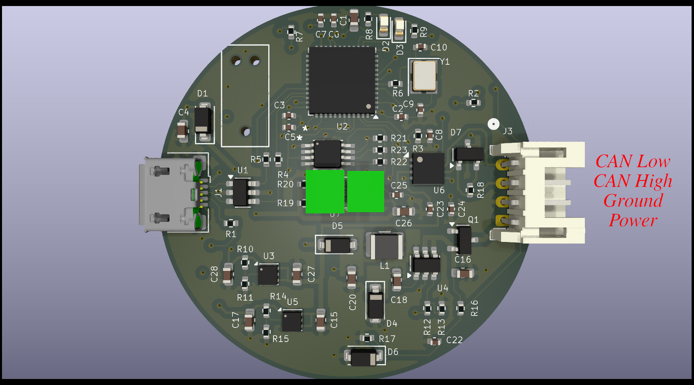

# I'm Not Touching You

This is a small CAN based Time-of-Flight (TOF) sensor. It determines the distance
to an object and sends the resulting message on the CAN bus.

# Design
The block diagram is shown below. The design consists of an input buck regulator.
The regulator should be good up to 24V, but was designed to work at 12V. There
is reverse battery protection, so it should handle accidentially connecting
the battery up in reverse.

The buck generates 5V which is used for the CAN transceiver. The 5V is fed
to two LDO's to generate 3.3V for the processor and 2.8V for the TOF sensor.

There are two status LEDs on the board. An STM32G431 processor powers everything.

There are three user accessible connectors:
Main J3:
| Pin | Use |
| -- | -- |
| 1 | Power |
| 2 | Ground |
| 3 | CAN High |
| 4 | CAN Low |

The mate is a **JST PHR-4**

There is a standard USB Micro B connector that connects to a PC. It enumerates
as a serial port.

# Software
The software uses the STM32CubeIDE to build the code. I really wanted to use CMake with the CubeMX tool,
but I was having trouble getting the code to work correctly. So CudeIDE for the win.

The code is SUPER simple. It just reads the TOF sensor once every 100 ms and sends out a CAN message.

The CAN message is defined as:
| Byte | Definition |
| ---- | --- |
| 1 | API Status |
| 2-3 | distance in mm |
| 4-5 | ambient Mcps |
| 6-7 | signal Mcps |

The **API Status** is the not well defined. If the value is zero, the distance is valid.
The distance is in millimeters.
The Ambient and Signal values are in Millions of Chips Per Second.

The CAN ID is based on the WPILib CAN interface:

Device Type is Misc (10)
Manufacturer is 20
API Class is Status (5)
API Index is 0
Device Number is currently 0 (need to figure out how to have several of these on the bus)

## SWD Debug
It is assumed you are using a JLink and it is installed in **/opt/SEGGER/JLink**
In the scripts directory:
1) Run **gdbstart.sh** in one terminal
2) Run debug.sh in other terminal. You now have the full power of GDB at your literial finger tips

## Firmware upgrade
There is no ability to upgrade the firmware right now. It will be fixed in future PCB rev.
Currently you have to JTAG/SWD the firmware.

# Potential other parts
STM32G0:
https://jlcpcb.com/partdetail/STMicroelectronics-STM32G0B1CBT6/C2847904
Can we use a M0???

